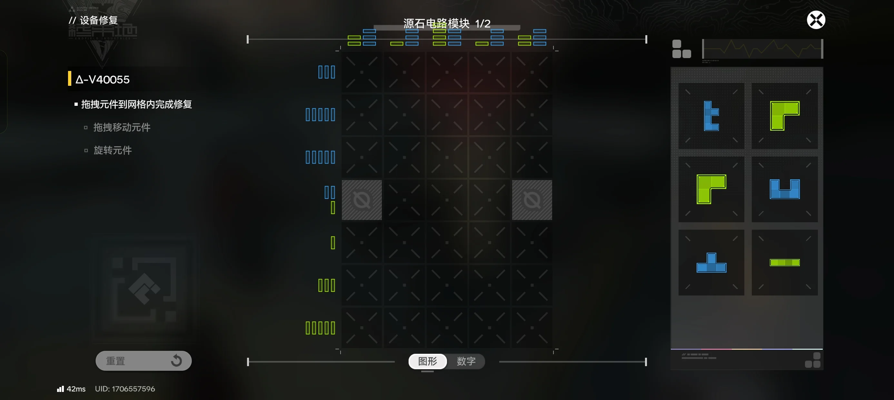

# EndfieldPuzzleSolver
Puzzle solver for solving Originium Circuitry puzzles in Arknights: Endfield game.

## Example Usage

> [!NOTE]
> These example usage inputs are copied from another repository because I've already solved most of the puzzles by hand; I can't take screenshots anymore.

### Example 1


> ```
> Board Format:
>   1 2 3 4 - column requirements
> 1 . . . .
> 2 . . . .
> 3 . . . .
> 4 . . . .
>  \
>   row requirements
>
> . - Empty
> * - Unavailable
> 0~9 - Occupied with color
> Please enter the board content:
> ```

```
.....
.....
..0..
.....
.....

```

> ```
> Please input column requirements for color 0:
> ```

```
3 5 5 5 3
```

> ```
> Please input row requirements for color 0:
> ```

```
3 5 5 5 3
```

> ```
> Please input row requirements for color 1:
> ```

```

```

> ```
> Please input pixels for block A:
> ```

```
.0
000
.0

```

> ```
> Please input pixels for block B:
> ```

```
.00
00
0

```

> ```
> Please input pixels for block C:
> ```

```
.0
000
.0

```

> ```
> Please input pixels for block D:
> ```

```
.00
00
0

```

> ```
> Please input pixels for block E:
> ```

```

```

> ```
> ----------------
> Solution 1
> .DDC.
> DDCCC
> DA0CB
> AAABB
> .ABB.
> ----------------
> Solution 2
> .ABB.
> AAABB
> DA0CB
> DDCCC
> .DDC.
> ----------------
> Solution 3
> .BBC.
> BBCCC
> BA0CD
> AAADD
> .ADD.
> ----------------
> Solution 4
> .CBB.
> CCCBB
> DC0AB
> DDAAA
> .DDA.
> ----------------
> Solution 5
> .ADD.
> AAADD
> BA0CD
> BBCCC
> .BBC.
> ----------------
> Solution 6
> .CDD.
> CCCDD
> BC0AD
> BBAAA
> .BBA.
> ----------------
> Solution 7
> .DDA.
> DDAAA
> DC0AB
> CCCBB
> .CBB.
> ----------------
> Solution 8
> .BBA.
> BBAAA
> BC0AD
> CCCDD
> .CDD.
> ----------------
> ```

### Example 2


> ```
> Board Format:
>   1 2 3 4 - column requirements
> 1 . . . .
> 2 . . . .
> 3 . . . .
> 4 . . . .
>  \
>   row requirements
>
> . - Empty
> * - Unavailable
> 0~9 - Occupied with color
> Please enter the board content:
> ```

```
.....
.....
.....
...*.
....*

```

> ```
> Please input column requirements for color 0:
> ```

```
4 5 3 2 1
```

> ```
> Please input row requirements for color 0:
> ```

```
4 5 3 2 1
```

> ```
> Please input column requirements for color 1:
> ```

```

```

> ```
> Please input pixels for block A:
> ```

```
000
0

```

> ```
> Please input pixels for block B:
> ```

```
000
.0

```

> ```
> Please input pixels for block C:
> ```

```
000
.0

```

> ```
> Please input pixels for block D:
> ```

```
00
0

```

> ```
> Please input pixels for block E:
> ```

```

```

> ```
> ----------------
> Solution 1
> AAAC.
> ABCCC
> BBB..
> DD.*.
> .D..*
> ----------------
> Solution 2
> CAAD.
> CCADD
> CBA..
> BB.*.
> .B..*
> ----------------
> Solution 3
> BAAD.
> BBADD
> BCA..
> CC.*.
> .C..*
> ----------------
> Solution 4
> AAAB.
> ACBBB
> CCC..
> DD.*.
> .D..*
> ----------------
> ```

### Example 3



> ```
> Board Format:
>   1 2 3 4 - column requirements
> 1 . . . .
> 2 . . . .
> 3 . . . .
> 4 . . . .
>  \
>   row requirements
>
> . - Empty
> * - Unavailable
> 0~9 - Occupied with color
> Please enter the board content:
> ```

```
.....
.....
.....
*...*
.....
.....
.....

```

> ```
> Please input column requirements for color 0:
> ```

```
2 1 4 1 2
```

> ```
> Please input row requirements for color 0:
> ```

```
0 0 0 1 1 3 5
```

> ```
> Please input column requirements for color 1:
> ```

```
3 3 3 3 3
```

> ```
> Please input row requirements for color 1:
> ```

```
3 5 5 2 0 0 0
```

> ```
> Please input column requirements for color 2:
> ```

```

```

> ```
> Please input pixels for block A:
> ```

```
1
11
1
11

```

> ```
> Please input pixels for block B:
> ```

```
00
0

```

> ```
> Please input pixels for block C:
> ```

```
00
0

```

> ```
> Please input pixels for block D:
> ```

```
1.1
111

```

> ```
> Please input pixels for block E:
> ```

```
.1
111

```

> ```
> Please input pixels for block F:
> ```

```
0000

```

> ```
> Please input pixels for block G:
> ```

```

```

> ```
> ----------------
> Solution 1
> E.D.D
> EEDDD
> EAAAA
> *AFA*
> ..F..
> C.F.B
> CCFBB
> ----------------
> Solution 2
> E.D.D
> EEDDD
> EAAAA
> *AFA*
> ..F..
> B.F.C
> BBFCC
> ----------------
> ```

## Contribution
Welcome to contribute to this project. Feel free to open an issue or submit a pull request.
